# Dynamic Portals - Diagrama de Arquitetura e Dependências

## 📊 Diagrama de Dependências (Mermaid)

```mermaid
graph TB
    %% Core/Entry Point
    DP[DynamicPortals<br/>★ Ponto de entrada]
    
    %% Data Layer
    PPD[PlayerProgressData<br/>💾 Dados do jogador]
    MA[ModAttachments<br/>🔗 Registry de attachments]
    MC[ModConstants<br/>📋 Constantes]
    
    %% Event Handlers
    PEH[PlayerEventHandler<br/>👤 Eventos de jogador]
    MKH[MobKillHandler<br/>⚔️ Sistema de kills/assists]
    AEH[AdvancementEventHandler<br/>🏆 Eventos de conquistas]
    POEH[PortalEventHandler<br/>🌀 Bloqueio de portais]
    
    %% Network Layer
    SPP[SyncProgressPacket<br/>📡 Pacote de sincronização]
    MP[ModPackets<br/>📨 Registry de pacotes]
    CPH[ClientPacketHandler<br/>📥 Handler cliente]
    
    %% Client Layer
    CPC[ClientProgressCache<br/>💭 Cache cliente]
    PHUD[ProgressHUD<br/>🖥️ Interface visual]
    MKB[ModKeyBindings<br/>⌨️ Teclas de atalho]
    
    %% API Layer
    IPRA[IPortalRequirementAPI<br/>🔌 Interface pública]
    PRR[PortalRequirementRegistry<br/>📚 Registro de requisitos]
    PR[PortalRequirement<br/>📝 Modelo de requisito]
    
    %% Advancement System
    MT[ModTriggers<br/>🎯 Registry de triggers]
    KRT[KillRequirementTrigger<br/>✅ Trigger customizado]
    MAP[ModAdvancementProvider<br/>📜 Gerador de advancements]
    
    %% Data Generation
    DG[DataGenerators<br/>⚙️ Setup de datagen]
    
    %% ========== DEPENDENCIES ==========
    
    %% DynamicPortals dependencies
    DP -->|registra| MA
    DP -->|registra| MT
    DP -->|registra| MP
    DP -->|escuta| PEH
    DP -->|escuta| MKH
    DP -->|escuta| AEH
    DP -->|escuta| POEH
    DP -->|inicializa| PRR
    DP -->|configura| MKB
    DP -->|aciona| DG
    DP -->|usa| MC
    
    %% PlayerProgressData dependencies
    PPD -->|usa| MC
    
    %% ModAttachments dependencies
    MA -->|define tipo| PPD
    
    %% Event Handlers -> Data
    PEH -->|lê/escreve| PPD
    PEH -->|usa| MA
    PEH -->|envia| SPP
    PEH -->|usa| MC
    
    MKH -->|lê/escreve| PPD
    MKH -->|usa| MA
    MKH -->|envia| SPP
    MKH -->|dispara| MT
    MKH -->|usa| MC
    
    AEH -->|lê/escreve| PPD
    AEH -->|usa| MA
    AEH -->|envia| SPP
    
    POEH -->|lê| PPD
    POEH -->|usa| MA
    POEH -->|usa| MC
    
    %% Network Layer
    SPP -->|serializa| PPD
    MP -->|registra| SPP
    CPH -->|processa| SPP
    CPH -->|atualiza| CPC
    
    %% Client Layer
    CPC -->|recebe de| SPP
    PHUD -->|lê| CPC
    PHUD -->|usa| MC
    MKB -->|controla| PHUD
    
    %% API Layer
    PRR -->|implementa| IPRA
    PRR -->|armazena| PR
    PRR -->|usa| MC
    PR -->|usa| MC
    
    %% Advancement System
    MT -->|registra| KRT
    KRT -->|lê| PPD
    KRT -->|usa| MA
    MAP -->|gera com| KRT
    MAP -->|usa| MC
    MAP -->|usa| PR
    DG -->|escuta evento| MAP
    
    %% Styling
    classDef coreClass fill:#ff6b6b,stroke:#c92a2a,stroke-width:3px,color:#fff
    classDef dataClass fill:#4ecdc4,stroke:#0b7285,stroke-width:2px,color:#fff
    classDef eventClass fill:#95e1d3,stroke:#0ca678,stroke-width:2px,color:#000
    classDef networkClass fill:#ffd93d,stroke:#f08c00,stroke-width:2px,color:#000
    classDef clientClass fill:#6bcf7f,stroke:#2f9e44,stroke-width:2px,color:#fff
    classDef apiClass fill:#a29bfe,stroke:#6c5ce7,stroke-width:2px,color:#fff
    classDef advClass fill:#fd79a8,stroke:#e84393,stroke-width:2px,color:#fff
    
    class DP coreClass
    class PPD,MA,MC dataClass
    class PEH,MKH,AEH,POEH eventClass
    class SPP,MP,CPH networkClass
    class CPC,PHUD,MKB clientClass
    class IPRA,PRR,PR apiClass
    class MT,KRT,MAP,DG advClass
```



## 🏗️ Estrutura em Camadas

### 1️⃣ **Camada Core (Inicialização)**
- `DynamicPortals` - Ponto de entrada do mod, registra todos os componentes

### 2️⃣ **Camada de Dados (Data Layer)**
- `PlayerProgressData` - Modelo de dados do jogador (kills, items, mortes, achievements)
- `ModAttachments` - Registry de data attachments do NeoForge
- `ModConstants` - Constantes globais (IDs, mensagens, configurações)

### 3️⃣ **Camada de Eventos (Event Layer)**
- `PlayerEventHandler` - Morte, clone, login, pickup de items
- `MobKillHandler` - Sistema de kills, assists (5s window), tracking de dano
- `AdvancementEventHandler` - Sincronização quando conquistas são desbloqueadas
- `PortalEventHandler` - Bloqueia viagem dimensional baseado em achievements

### 4️⃣ **Camada de Rede (Network Layer)**
- `SyncProgressPacket` - Pacote customizado para sincronizar progresso
- `ModPackets` - Registry de network payloads
- `ClientPacketHandler` - Processa pacotes no cliente

### 5️⃣ **Camada Cliente (Client Layer)**
- `ClientProgressCache` - Cache local do progresso para renderização
- `ProgressHUD` - HUD visual com progresso (Tab para alternar fases)
- `ModKeyBindings` - Keybindings (tecla P para toggle do HUD)

### 6️⃣ **Camada de API (API Layer)**
- `IPortalRequirementAPI` - Interface pública para outros mods
- `PortalRequirementRegistry` - Singleton que gerencia requisitos
- `PortalRequirement` - Modelo de requisito (Builder pattern)

### 7️⃣ **Sistema de Advancements**
- `ModTriggers` - Registry de advancement triggers customizados
- `KillRequirementTrigger` - Trigger que valida kills/items
- `ModAdvancementProvider` - Data generator para JSON de advancements
- `DataGenerators` - Setup do evento de data generation

## 🔄 Fluxos Principais

### **Fluxo 1: Player mata um Mob**
```
Mob morto → MobKillHandler.onLivingDeath
  ↓
Verifica assistência (últimos 5s)
  ↓
Marca mob em PlayerProgressData
  ↓
Dispara KillRequirementTrigger
  ↓
Se requisitos completos → Desbloqueia achievement
  ↓
Envia SyncProgressPacket → Cliente
  ↓
ClientPacketHandler → ClientProgressCache
  ↓
ProgressHUD renderiza atualização
```

### **Fluxo 2: Player tenta usar Portal**
```
Player entra em portal → PortalEventHandler.onEntityTravelToDimension
  ↓
Lê PlayerProgressData via ModAttachments
  ↓
Verifica achievement necessário
  ↓
Se NÃO tem achievement → Cancela evento + mensagem
  ↓
Se TEM achievement → Permite teleporte
```

### **Fluxo 3: Player morre**
```
Morte → PlayerEventHandler.onPlayerDeath
  ↓
Incrementa contador de mortes
  ↓
Se mortes >= limite (5) → RESET completo do progresso
  ↓
Envia SyncProgressPacket
  ↓
No respawn → PlayerEventHandler.onPlayerClone copia dados
```

### **Fluxo 4: Player pega Item especial (Diamante/Netherite)**
```
ItemEntityPickupEvent → PlayerEventHandler.onItemPickup
  ↓
Verifica se é DIAMOND ou NETHERITE_INGOT
  ↓
Marca item em PlayerProgressData
  ↓
Dispara KillRequirementTrigger
  ↓
Sincroniza com cliente
```

## 📦 Dependências Externas (NeoForge/Minecraft)

```
NeoForge APIs:
├─ IEventBus (modEventBus)
├─ NeoForge.EVENT_BUS (gameEventBus)
├─ Data Attachments (IAttachmentHolder)
├─ Network Payloads (CustomPacketPayload)
├─ Advancement Triggers (SimpleCriterionTrigger)
└─ Data Generators (GatherDataEvent)

Minecraft APIs:
├─ EntityType (registro de mobs)
├─ Items (registro de items)
├─ ResourceLocation (identificadores)
├─ CompoundTag (serialização NBT)
└─ GuiGraphics (renderização HUD)
```

## 🎯 Pontos de Extensão (Onde adicionar features)

### ✅ **Para adicionar novo requisito de portal:**
1. Criar requisito usando `PortalRequirement.builder()`
2. Registrar em `PortalRequirementRegistry.getInstance().registerPortalRequirement()`
3. Criar advancement JSON via `ModAdvancementProvider`

### ✅ **Para adicionar novo tipo de tracking:**
1. Adicionar campo em `PlayerProgressData`
2. Adicionar serialização NBT (saveNBT/loadNBT)
3. Adicionar no `SyncProgressPacket` (record + codec)
4. Atualizar `ClientProgressCache`
5. Criar handler de evento apropriado

### ✅ **Para adicionar novo trigger de advancement:**
1. Criar classe extends `SimpleCriterionTrigger<T>`
2. Registrar em `ModTriggers`
3. Criar TriggerInstance com Codec
4. Disparar trigger nos eventos apropriados

### ✅ **Para adicionar novo HUD/UI:**
1. Criar classe com `@SubscribeEvent` para `RenderGuiLayerEvent`
2. Ler dados de `ClientProgressCache`
3. Renderizar usando `GuiGraphics`

## 📊 Métricas do Projeto

- **Total de classes Java:** ~20
- **Camadas arquiteturais:** 7
- **Eventos registrados:** 8+
- **Network packets:** 1
- **Advancement triggers:** 1
- **Data attachments:** 1
- **Dimensões gerenciadas:** 2 (Nether, End)

---

**Última atualização:** 4 de dezembro de 2025
