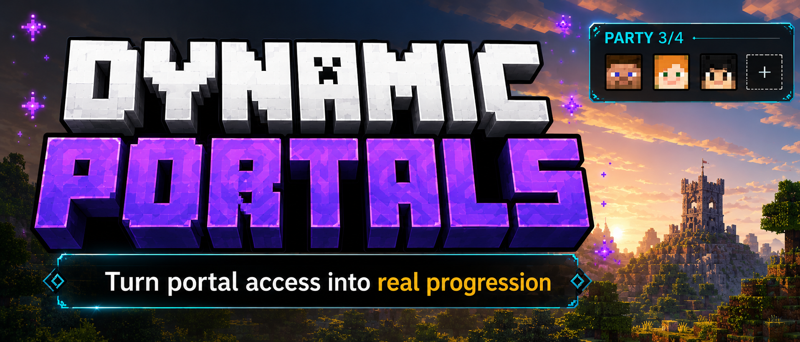

# Dynamic Portals 🚪
**Dynamic Portals** turns portal access into real progression for Minecraft **1.21.1 NeoForge**.

Lock the Nether, the End, or custom dimensions behind configurable goals: kill mobs, gather items, complete advancements, or use optional bypass items. Built for survival servers, modpacks, and players who want portals to feel earned.

---

## Highlights ✨
- **Configurable progression:** kill, item, advancement, and bypass requirements.
- **Progress Hub UI:** portal cards, progress bars, details, and mob head icons.
- **Simple parties:** create a party, share a 5-character code, and progress together.
- **Saved party progress:** offline members keep benefiting from group progress.
- **Modpack-friendly rules:** missing modded mobs/items stay inactive instead of blocking portals.
- **Chat feedback and sounds:** clear progress, completion, and unlock moments.
- **Admin debug tools:** complete or reset real progression for testing.

---

## Progress Hub 🧭
Open the Hub with **H** by default.

Track portal access, inspect missing requirements, check detailed counters, and manage party progression from one clean in-game screen. Kill requirements can display custom PNG mob faces in the Details view.

---

## Party Play 👥
- `/dp party create`
- `/dp party join <code>`
- `/dp party leave`
- `/dp party info`

Party progress is stored in the party itself. If one member keeps playing while another is offline, the returning member will still see the shared progress.

---

## Configuration ⚙️
Generated config: `config/dynamicportals-common.toml`

Requirement formats:
- `destination_dimension|entity_id|count`
- `destination_dimension|item_id|count`
- `destination_dimension|advancement_id`

You can add vanilla or modded mobs, items, advancements, and dimensions. If a referenced mob or item is not loaded, that rule simply stays inactive.

---

## Useful Commands 🛠️
- `/dp check`
- `/dp check <dimension>`
- `/dp check pending`
- `/dp debug complete <dimension> [targets]`
- `/dp debug reset [dimension|all] [targets]`

Debug commands require permission level 2.

✅Full Mod Guide: [Documentation.md](Documentation.md)
---
**🐛 Issues / Bugs ? ->** [https://github.com/II-mirai-II/Soul-Debt/issues](https://github.com/II-mirai-II/Soul-Debt/issues)
